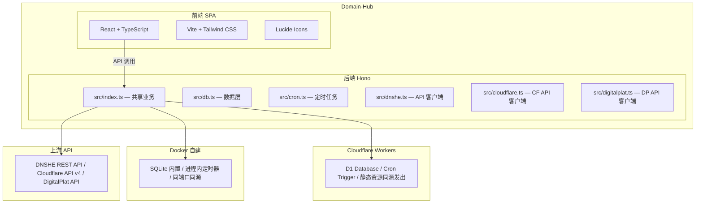

# 🌐 Domain Hub（域汇）

> 多服务商跨账号多域名自动化集中管理系统

[](https://github.com/lioil522/domain-hub/actions/workflows/docker.yml)
[](https://github.com/lioil522/domain-hub/actions/workflows/deploy.yml)

Domain Hub（域汇）是一款**多服务商域名集中管理面板**：原生面向 [DNSHE](https://my.dnshe.com) 免费域名，支持多账号资产看板、DNS 解析托管、到期自动续期、多平台通知推送；亦可通过 API Token 绑定 Cloudflare 账号，在独立标签页直接管理托管于 Cloudflare 的域名解析，并支持接入 DigitalPlat 账号管理其域名资产。同一套代码同时支持 **Cloudflare Workers** 和 **Docker 自建** 两种部署形态。

---

## ✨ 功能特性

- **多账号管理** — 支持绑定多个 DNSHE API Key，跨账号统一管理域名资产
- **Cloudflare 管理** — 独立标签页绑定 Cloudflare 账号（API Token，绑定时在线校验、别名自动取账号名），自动同步 zones 列表；支持 Cloudflare 全部 21 种记录类型的增删改与批量操作、橙色云代理开关、控制台深链；域名页对已委派且已绑定的域名一键跳转定位
- **DigitalPlat 管理** — 独立标签页绑定 DigitalPlat 账号（API Key），同步域名资产与解析记录
- **自定义服务商** — 为没有 API 的社区公益域名（eu.org、pp.ua 等）建「分组 → 账号 → 域名」三层结构手动录入，到期时间留空即为永久；到期前照常走通知渠道提醒
- **域名资产看板** — 一览所有域名的状态、到期时间、DNS 托管商等信息
- **DNS 解析管理** — 在面板内直接增删改 DNS 记录（A / AAAA / CNAME / MX / TXT 等）
- **自动续期** — 每日定时扫描即将到期的域名并自动续期，无人值守
- **域名同步** — 自动从 DNSHE 上游拉取最新域名列表与状态，支持深度同步
- **DNS 托管商识别** — 通过 DoH 查询 NS 记录，自动识别 Cloudflare / DNSPod / Vercel 等托管商
- **通知推送** — 支持钉钉、飞书、企业微信、Server酱、自定义 Webhook 等多平台通知
- **安全认证** — 用户名 + 密码登录，密码经 PBKDF2 加盐哈希存储；可选 2FA (TOTP) 两步验证
- **AES-GCM 加密** — API Secret 与 2FA 密钥使用 AES-GCM 加密存储，支持密钥自动生成
- **深色 / 浅色主题** — 支持主题切换，刷新无闪白
- **国际化域名** — 支持 Punycode 编码的国际化域名

---

## 🏗️ 架构概览



---

## 🚀 部署方式

### 方式一：Cloudflare Workers — GitHub Actions 一键部署（推荐）

适合不想自建服务器、追求零运维的用户。Fork 仓库后配置 Secrets，推送到 `main` 即自动部署。

前端与后端在**同一个 Worker** 里：静态资源由 Cloudflare 直接发出（不进 Worker，也不计 Worker 请求数），只有 `/api/*` 才执行脚本。因此没有 Pages 项目、没有第二个域名，也不需要配 CORS。

#### 1. Fork 仓库

在 GitHub 上 Fork 本仓库到自己的账号下。

#### 2. 获取 Cloudflare 凭据

登录 [Cloudflare Dashboard](https://dash.cloudflare.com/)：

- **Account ID**：在任意域名的「概述」页右侧栏可以找到
- **API Token**：进入「我的个人资料」→「API 令牌」→「创建令牌」，需要以下权限：

| 权限 | 说明 |
|------|------|
| `Workers Scripts:编辑` | 部署 Worker（后端脚本 + 前端静态资源） |
| `D1:编辑` | 自动创建 / 绑定 D1 数据库 |
| `Workers Routes:编辑` | 自动检测自定义域名 |
| `Zone:读取` | 查询域名路由 |

#### 3. 配置 GitHub Secrets

进入 Fork 仓库的 `Settings` → `Secrets and variables` → `Actions` → `New repository secret`，添加以下 Secrets：

| Secret 名称 | 是否必填 | 说明 |
|-------------|---------|------|
| `CLOUDFLARE_API_TOKEN` | ✅ 必填 | 上一步创建的 API Token |
| `CLOUDFLARE_ACCOUNT_ID` | ✅ 必填 | Cloudflare 账户 ID |
| `CLOUDFLARE_D1_DATABASE_ID` | 可选 | D1 数据库 ID，留空则自动创建 |
| `AES_KEY` | 可选 | 加密密钥，留空则首次部署自动生成 |
| `ADMIN_TOKEN` | 可选 | 应急后门令牌 |
| `WEBHOOK_URL` | 可选 | 通知推送地址 |
| `ALLOWED_ORIGIN` | 可选 | CORS 白名单，逗号分隔。前后端同源，正常部署**不需要**；只有把前端另行托管到别的域名时才填 |

#### 4. 触发部署

配置完 Secrets 后，任选一种方式触发：

- **推送到 main 分支**（自动触发）
- **手动触发**：进入 `Actions` → `Deploy to Cloudflare` → `Run workflow`

#### 工作流自动完成的事项

部署工作流会自动处理以下所有步骤，无需手动干预：

1. ✅ 查询或创建 D1 数据库（`domain-hub-db`）
2. ✅ 自动检测 Worker 是否绑定自定义域名（绑了就关掉 workers.dev 与预览 URL）
3. ✅ 构建前端产物到 `frontend/dist`
4. ✅ 部署 Worker —— 后端脚本与前端静态资源在同一次 `wrangler deploy` 里上传
5. ✅ 生成或同步 AES_KEY 加密密钥
6. ✅ 同步可选 Secrets（`ADMIN_TOKEN` / `WEBHOOK_URL`）到 Worker

> **💡 首次部署后**，访问地址写在 `Actions` → 那次运行的**摘要页**顶部（形如 `https://domain-hub.<你的子域>.workers.dev`）。浏览器打开它，在登录页自行设置管理员用户名与密码。
>
> **🔄 从旧版本升级：** 旧版把前端单独发到 Cloudflare Pages（`domain-hub-frontend`），现在不再需要。Worker 名字没变，D1 与 `AES_KEY` 原地保留，**数据不受影响**，升级后直接访问 Worker 地址即可。可以顺手清掉这些残留：
>
> - Pages 项目不会再更新 —— 在 Dashboard 删除，或 `npx wrangler pages project delete domain-hub-frontend`
> - `ALLOWED_ORIGIN` Secret —— 前后端已同源，用不到了（若你把前端另托管在别处并想继续这么用，就留着）
> - 仓库变量 `SKIP_CLOUDFLARE_PAGES` —— 工作流已不再读取它，删掉即可

---

### 方式二：Docker 自建

适合有自己服务器、想完全掌控数据的用户。只需一个 `docker-compose.yml` 即可启动：

```bash
# 1. 下载 docker-compose.yml
curl -O https://raw.githubusercontent.com/lioil522/domain-hub/main/docker-compose.yml

# 2. 启动（所有环境变量均有默认值，无需额外配置）
docker compose up -d

# 3. 浏览器打开 http://<服务器IP>:8787
#    首次进入自行设置管理员用户名与密码
```

> **💡 自定义配置：** 如需调整环境变量，直接编辑 `docker-compose.yml` 中的 `environment` 段，把 `${VAR:-}` 替换成实际值即可：
>
> ```yaml
> environment:
>   AES_KEY: your-secret-key        # 替换 ${AES_KEY:-}
>   WEBHOOK_URL: https://your-hook  # 替换 ${WEBHOOK_URL:-}
>   WEBHOOK_TYPE: dingtalk          # 替换 ${WEBHOOK_TYPE:-}
> ```
>
> 也可以创建 `.env` 文件，compose 会自动读取。变量说明见下方[环境变量](#️-环境变量)章节。

**更新到最新版：**

```bash
docker compose pull && docker compose up -d
```

> **⚠️ 大陆网络提示：** `ghcr.io` 拉取可能很慢，可在 `.env` 中设置镜像站：
>
> ```
> IMAGE_REPO=ghcr.nju.edu.cn/lioil522/domain-hub
> ```

#### 镜像说明

- 多架构支持：`amd64` / `arm64`，Docker 自动匹配
- 运行时镜像**不含 node_modules**，后端由 esbuild 打包为单文件（约 244KB）
- 以 `node` 用户（uid 1000）运行，非 root
- 内置 HEALTHCHECK，30 秒检测一次

---

## ⚙️ 环境变量

所有变量均为**可选**，全部留空也能正常启动。

| 变量 | 说明 | 默认值 |
|------|------|--------|
| `IMAGE_TAG` | Docker 镜像版本 | `latest` |
| `IMAGE_REPO` | Docker 镜像地址 | `ghcr.io/lioil522/domain-hub` |
| `AES_KEY` | AES-GCM 加密密钥，用于加密 API Secret 与 2FA 密钥 | 自动生成并保存到 `/data/aes.key` |
| `ADMIN_TOKEN` | 应急后门令牌，忘记密码时的兜底登录方式 | 不启用 |
| `WEBHOOK_URL` | Webhook 推送地址 | — |
| `WEBHOOK_TYPE` | Webhook 类型：`dingtalk` / `feishu` / `wecom` / `serverchan` / `custom` | — |
| `ALLOWED_ORIGIN` | CORS 允许的来源（逗号分隔），自建版同源无需配置 | — |
| `DEFAULT_API_KEY` | 首次启动自动绑定的 DNSHE API Key | — |
| `DEFAULT_API_SECRET` | 首次启动自动绑定的 DNSHE API Secret | — |
| `DEFAULT_API_ALIAS` | 默认账号别名 | — |
| `CRON_UTC_HOUR` | 定时任务执行时刻（UTC 小时） | `2`（北京时间 10:00） |
| `CRON_UTC_MINUTE` | 定时任务执行时刻（UTC 分钟） | `0` |
| `DISABLE_CRON` | 设为 `1` 关闭每日自动同步与续期 | — |
| `TZ` | 容器内日志时区 | `Asia/Shanghai` |

> **⚠️ 备份提醒：** 无论 `AES_KEY` 是手动配置还是自动生成，都必须与数据库一起备份。密钥丢失后，数据库中加密的 API Secret 和 2FA 密钥将无法解密。

---

## 📁 项目结构

```
Domain-Hub/
├── src/                        # 共享业务代码（Workers 与自建版共用）
│   ├── index.ts                #   Hono 路由与 API 处理
│   ├── db.ts                   #   数据库管理器（加密、鉴权、CRUD）
│   ├── cron.ts                 #   定时任务（域名同步、自动续期、通知推送）
│   ├── dnshe.ts                #   DNSHE API 客户端
│   ├── cloudflare.ts           #   Cloudflare API v4 客户端（zone 与解析记录）
│   ├── digitalplat.ts          #   DigitalPlat API 客户端
│   ├── dns-provider.ts         #   DNS 托管商识别
│   └── punycode.ts             #   国际化域名编码
│
├── server/                     # 自建版专属（Node.js 运行时适配）
│   ├── index.ts                #   Node 入口（env 绑定、定时器、AES 密钥自举）
│   ├── d1-sqlite.ts            #   D1 → SQLite 适配层（Node 内置 node:sqlite）
│   ├── d1-sqlite.test.ts       #   适配层自检（17 项测试）
│   ├── static.ts               #   静态资源服务（SPA 兜底、ETag、缓存头）
│   └── tsconfig.json           #   自建侧 TypeScript 配置
│
├── frontend/                   # 前端（React + TypeScript + Vite）
│   ├── src/
│   │   ├── App.tsx             #   主应用组件
│   │   ├── main.tsx            #   入口
│   │   ├── dnsrecords.ts       #   DNS 记录类型定义
│   │   ├── geodata.ts          #   地理数据（线路选择）
│   │   ├── rulegen.ts          #   规则生成器
│   │   └── ...
│   ├── .env.selfhost           #   同源部署的前端环境变量（API 基准地址 = /）
│   ├── vite.config.ts          #   Vite 配置（开发代理到 8787）
│   └── tailwind.config.js      #   Tailwind CSS 配置
│
├── .github/workflows/
│   ├── docker.yml              #   自建镜像构建与发布（amd64 + arm64）
│   └── deploy.yml              #   Cloudflare Workers 部署（后端 + 前端静态资源）
│
├── schema.sql                  # 数据库表结构
├── Dockerfile                  # 三阶段构建（前端 → 后端 → 运行时）
├── docker-compose.yml          # Docker Compose 编排
├── wrangler.toml               # Cloudflare Workers 配置（含静态资源托管 [assets]）
├── .env.example                # 环境变量示例
└── package.json                # 后端依赖与脚本
```

---

## 🛠️ 本地开发

### 前置要求

- **Node.js** ≥ 22.5（自建版需要内置的 `node:sqlite`，Wrangler 4 也要求 ≥ 22）
- **npm**
- **Wrangler** ≥ 4（仅 Cloudflare Workers 开发需要，已在 devDependencies 里）

### Cloudflare Workers 模式

```bash
# 安装依赖
npm install
npm --prefix frontend install

# ⚠️ 先构建一次前端：wrangler.toml 的 assets.directory 指向 frontend/dist，
#    该目录不存在时 wrangler dev / deploy 会直接报错退出
npm --prefix frontend run build

# 启动后端（默认端口 8787，同时把 frontend/dist 当静态资源发出）
npm run dev

# 改前端时另起 Vite 开发服务器（默认端口 3000，自动代理 /api 到 8787）
npm --prefix frontend run dev
```

### 自建模式

```bash
# 安装依赖
npm install

# 类型检查
npx tsc --noEmit          # Workers 侧
npm run verify:node       # 自建侧

# 适配层自检
npm run test:node         # 17 项测试

# 构建与运行
npm run build:node
npm run start:node
```

---

## 📝 数据库结构

| 表名 | 用途 |
|------|------|
| `accounts` | API 账号（别名、API Key、加密后的 API Secret）；自定义服务商的「分组」也存在这里，`provider = 'custom'` |
| `domains_cache` | 域名缓存（状态、到期时间、DNS 托管商、续期记录） |
| `logs` | 系统运行日志（同步、续期、鉴权、操作等分类） |
| `settings` | 面板配置（续期阈值、通知渠道等） |
| `cache` | API 上游响应缓存（防止频繁调用被判定滥用） |
| `domain_date_overrides` | 手动录入的注册 / 到期时间与注册来源（RDAP 查不到的域名） |
| `custom_accounts` | 自定义服务商分组下的账号（仅名称，无凭据） |
| `custom_domains` | 自定义服务商手动录入的域名（注册 / 到期时间、备注） |

---

## ❓ 常见问题

### Cloudflare 版与自建版有什么区别？

功能完全一致，差异仅在基础设施层面：

| | Cloudflare Workers | Docker 自建 |
|---|---|---|
| 数据库 | D1 (SQLite) | Node 内置 `node:sqlite` |
| 定时任务 | Cron Trigger | 进程内定时器 |
| 前端发布 | 同一个 Worker 的静态资源 | 同端口同源发出 |
| CORS | 同源，无需配置 | 同源，无需配置 |
| 运维 | Cloudflare 托管 | 自行运维 |

### 大陆访问 Cloudflare 版很慢怎么办？

先定位是不是被路由到了远端节点：打开 `https://<你的域名>/cdn-cgi/trace`，看 `colo=`。

| `colo` | 含义 |
|--------|------|
| `HKG` / `NRT` / `KIX` / `SIN` | 亚洲节点，正常，不必折腾 |
| `LAX` / `SJC` | 美西，偏慢但可用 |
| `AMS` / `FRA` 等欧洲节点 | 路由异常，首屏会明显卡 |

落在欧洲节点就是路由异常，而免费套餐不使用中国大陆网络，**没有任何开关能改变这个路由**。这种情况只能把部署搬走：见[方式二](#方式二docker-自建)，或直接 `npm run build:node` 裸机部署（后端不依赖 Workers 专属 API，`server/` 下已有完整的 Node 运行时适配）。

注意 `cf-ray` / `colo` 反映的是**发起请求那台机器**落到哪个 PoP。开着代理测、或从海外服务器上 `curl`，得到的结果与大陆访客无关。

### 如何从 Cloudflare 迁移到自建？

D1 和自建版用的都是 SQLite，表结构完全一致。导出 D1 数据库后直接放入 `/data` 目录即可。注意 `AES_KEY` 必须保持一致。

### 大陆网络拉取 Docker 镜像很慢怎么办？

在 `.env` 中配置镜像站：

```env
IMAGE_REPO=ghcr.nju.edu.cn/lioil522/domain-hub
```

Docker 的 `registry-mirrors` 只代理 Docker Hub，对 `ghcr.io` 无效。

### 忘记管理员密码怎么办？

如果配置了 `ADMIN_TOKEN` 环境变量，可以使用它作为兜底登录方式。如果未配置，需要删除数据库中的管理员数据重新初始化。

### 自定义服务商分组是做什么的？

给没有 API 的社区公益域名（eu.org、pp.ua、nn.kg 等）留的手动录入位。结构是「分组 → 账号 → 域名」三层：分组通常对应一个服务商，账号对应你在该服务商那边的注册账号，域名手动填注册 / 到期时间与备注。域名也可以不挂账号、直接挂在分组下。

这类分组没有上游，不参与域名同步、配额统计与自动续期，只做到期提醒 —— 阈值复用「自动续期天数」配置，触发时和其它域名一样走通知渠道。到期时间留空表示永久，这类域名不会产生提醒。若该域名恰好托管在已绑定的 Cloudflare 账号下，卡片上会出现跳转按钮。

### 自动续期会处理 Cloudflare 的域名吗？

不会。Cloudflare 账号仅同步 zones 列表（zone 有效期由注册商管理），不参与自动续期与配额统计；zone 的创建 / 删除请前往 Cloudflare 控制台。

### 绑定 Cloudflare 账号需要什么权限？

API Token 需包含 `Zone:Read` 与 `Zone DNS:Edit` 两项权限，作用范围建议覆盖要管理的域名。绑定时面板会调用 Cloudflare `user/tokens/verify` 在线校验，无效或已禁用的 Token 不会入库；同一 Cloudflare 账号不可重复绑定。若 Token 只有 Zone 类权限，账号信息接口会被拒，面板会自动退用 zones 数据内嵌的账号名。

---

## 📄 许可证

本项目基于开源许可证发布，详情请查看 [LICENSE](LICENSE) 文件。
